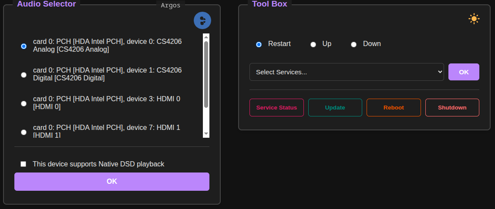

Audio Selector
==============

Select and set default Audio Device for [shairport-sync](https://github.com/mikebrady/shairport-sync), [Librespot](https://github.com/librespot-org/librespot), [Squeezelite](https://lyrion.org/players-and-controllers/squeezelite/).

Some of you like me run multiple DACs on a single computer. You could be running mpd, shairport-sync (for airplay), librespot (for spotify) or squeezelite for Lyrion Music Server or for your device to be an Roon end-piont. The audio device for mpd can be changed easily in the mpd client itself. For rest of the music software mentioned, you need to edit the configuration file and edit the playback device and then restart the software. <b>audio-selector</b> allows you to do that if you are a couch potato/potaato/whatever.



# Installation

## Install Open Build Service Repo (OBS)

You have three choices

1. Install the RPM directly from [Open Build Service](https://software.opensuse.org/download.html?project=home%3Ambhangui%3Araspi&package=audio-selector). This will pull in [daemontools](https://github.com/indimail/indimail-mta/tree/main/daemontools-x) as a dependency.
2. Clone this repo, copy the files to <u>/usr/lib/audio_selector</u> and install [daemontools](https://github.com/indimail/indimail-mta/tree/main/daemontools-x) or use systemd to run <b>audio-selector</b> automatically and continuously
3. Clone this repo, copy the files to <u>/usr/lib/audio_selector</u>  and execute `node /usr/lib/audio_selector/server.js` using your own method to run <b>audio-selectory</b> continuously.

If you want to use [daemontools](https://github.com/indimail/indimail-mta/tree/main/daemontools-x) and run <b>audio-selector</b> under supervision, first step is to update apt preferences so that it prefers Open Build Service repository instead of the debian repository for [daemontools](https://github.com/indimail/indimail-mta/tree/main/daemontools-x) package. My version of [daemontools](https://github.com/indimail/indimail-mta/tree/main/daemontools-x) has many features above that of the official package. Installing <b>audio-selector</b> will pull in [daemontools](https://github.com/indimail/indimail-mta/tree/main/daemontools-x) and install it.

If you are doing to use your own method to start audio\_selector, then you don't need to install the open build service repository. You just need to execute `env PORT=8080 node ./server.js` in the <u>/usr/lib/audio\_selector</u> directory, to run the selector on port 8080. The automated way to use daemontools or systemd or a variant of gentoo/alpine `rc` system. You need `nodejs` package installed on your system.

## Install daemontools, audio-selector

`sudo apt install nodejs daemontools audio-selector`

If you don't want to use daemontools, you can use audio-selector.service systemd unit file. See the next section.

```
Update Preferences so that daemontools is installed from OBS

(
echo "Package: *"
echo "Pin: origin download.opensuse.org"
echo "Pin-Priority: 1001"
) > /etc/apt/preferences.d/preferences
```

Second step is to install the debian apt repository for my daemontools package

```
Distribution Raspbian13

$ echo 'deb http://download.opensuse.org/repositories/home:/mbhangui:/raspi/Raspbian_13/ /' \
    | sudo tee /etc/apt/sources.list.d/raspi.list
$ curl -fsSL https://download.opensuse.org/repositories/home:mbhangui:raspi/Raspbian_13/Release.key | \
    gpg --dearmor | sudo tee /etc/apt/trusted.gpg.d/raspi.gpg > /dev/null
$ sudo apt update && sudo apt install audio-selector

Distribution Raspbian12

$ echo 'deb http://download.opensuse.org/repositories/home:/mbhangui:/raspi/Raspbian_12/ /' \
    | sudo tee /etc/apt/sources.list.d/raspi.list
$ curl -fsSL https://download.opensuse.org/repositories/home:mbhangui:raspi/Raspbian_12/Release.key | \
    gpg --dearmor | sudo tee /etc/apt/trusted.gpg.d/raspi.gpg > /dev/null
$ sudo apt update && sudo apt install audio-selector

Distribution Raspbian11

$ echo 'deb http://download.opensuse.org/repositories/home:/mbhangui:/raspi/Raspbian_11/ /' \
    | sudo tee /etc/apt/sources.list.d/raspi.list
$ curl -fsSL https://download.opensuse.org/repositories/home:mbhangui:raspi/Raspbian_11/Release.key | \
    gpg --dearmor | sudo tee /etc/apt/trusted.gpg.d/raspi.gpg > /dev/null
$ sudo apt update && sudo apt install audio-selector

Distribution Ubuntu_26.04

$ echo 'deb http://download.opensuse.org/repositories/home:/mbhangui:/raspi/xUbuntu_26.04/ /' \
    | sudo tee /etc/apt/sources.list.d/raspi.list
$ curl -fsSL https://download.opensuse.org/repositories/home:mbhangui:raspi/xUbuntu_26.04/Release.key \
    | gpg --dearmor | sudo tee /etc/apt/trusted.gpg.d/raspi.gpg > /dev/null
$ sudo apt update && sudo apt install audio-selector

Distribution Ubuntu_24.04

$ echo 'deb http://download.opensuse.org/repositories/home:/mbhangui:/raspi/xUbuntu_24.04/ /' \
    | sudo tee /etc/apt/sources.list.d/raspi.list
$ curl -fsSL https://download.opensuse.org/repositories/home:mbhangui:raspi/xUbuntu_24.04/Release.key \
    | gpg --dearmor | sudo tee /etc/apt/trusted.gpg.d/raspi.gpg > /dev/null
$ sudo apt update && sudo apt install audio-selector

Distribution Ubuntu_22.04

$ echo 'deb http://download.opensuse.org/repositories/home:/mbhangui:/raspi/xUbuntu_22.04/ /' \
    | sudo tee /etc/apt/sources.list.d/raspi.list
$ curl -fsSL https://download.opensuse.org/repositories/home:mbhangui:raspi/xUbuntu_22.04/Release.key \
    | gpg --dearmor | sudo tee /etc/apt/trusted.gpg.d/raspi.gpg > /dev/null
$ sudo apt update && sudo apt install audio-selector

Distribution Debian13

$ echo 'deb http://download.opensuse.org/repositories/home:/mbhangui:/raspi/Debian_13/ /' | \
    sudo tee /etc/apt/sources.list.d/raspi.list
$ curl -fsSL https://download.opensuse.org/repositories/home:mbhangui:raspi/Debian_13/Release.key | \
    gpg --dearmor | sudo tee /etc/apt/trusted.gpg.d/raspi.gpg > /dev/null
$ sudo apt update && sudo apt install audio-selector

Distribution Debian12

$ echo 'deb http://download.opensuse.org/repositories/home:/mbhangui:/raspi/Debian_12/ /' | \
    sudo tee /etc/apt/sources.list.d/raspi.list
$ curl -fsSL https://download.opensuse.org/repositories/home:mbhangui:raspi/Debian_12/Release.key | \
    gpg --dearmor | sudo tee /etc/apt/trusted.gpg.d/raspi.gpg > /dev/null
$ sudo apt update && sudo apt install audio-selector

Distribution Debian11

$ echo 'deb http://download.opensuse.org/repositories/home:/mbhangui:/raspi/Debian_11/ /' | \
    sudo tee /etc/apt/sources.list.d/raspi.list
$ curl -fsSL https://download.opensuse.org/repositories/home:mbhangui:raspi/Debian_11/Release.key | \
    gpg --dearmor | sudo tee /etc/apt/trusted.gpg.d/raspi.gpg > /dev/null
$ sudo apt update && sudo apt install audio-selector

Distribution Fedora Core 44

$ sudo dnf config-manager addrepo --from-repofile=https://download.opensuse.org/repositories/home:mbhangui:raspi/Fedora_44/home:mbhangui:raspi.repo
$ sudo dnf install audio-selector
```

## Install audio-selector service

Installing the <b>audio-selector</b> will automatically carry out this step. Carry out this step if you are cloning the git repository and want to do all steps manually. The command below will create <b>audio-selector</b> service to run on port 8080. You don't need this if you decide to use systemd.

`sudo ./create_service 8080`

If you desire not to have <b>audio-selector</b> under daemontools, you can use <u>/usr/lib/audio_selector/audio-selector.service</u>.

```
sudo cp /usr/lib/audio_selector/audio-selector.service /usr/lib/systemd/system
sudo systemctl daemon-reload
sudo systemctl enable audio-selector
sudo systemctl start audio-selector
sudo systemctl status audio-selector
```

## Check audio-selector service

If using daemontools you can check the status of this service using the below comman

`sudo svstat /service/audio-selector`

If using systemd you can check the status of this service using the below comman

`systemctl status audio-selector`

# Accessing the audio-selector interface

http://localhost:8080

or

http://ipaddr:8080

You can change the <b>PORT</b> on which <b>audio-selector</b> runs by editing <u>/service/audio-selector/variables/PORT</u> and restarting the <b>audio-selector</b> service. To restart <b>audio-selector</b> run the command `sudo svc -r /service/audio-selector`.

# Notes

1. This project has been created with the help of google AI. My own knowledge of writing web based applications is zero.
